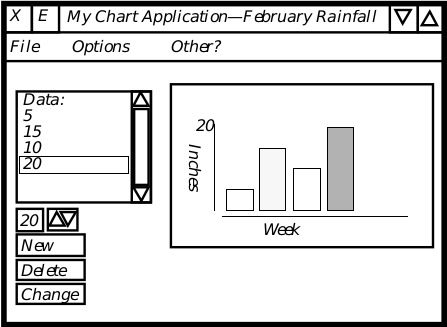

## 3 The Plan

The body of our tutorial consists of the step-by-step construction of an 
application. The first step when you set out on any software development 
project is to plan. Thus, we will start with a simple specification.

### 3.1 My Chart Application

**Precis:** Application accepts simple data entry and creates bar charts.

**Summary:** Application will allow the user to enter some numbers. 
Application will then create a simple bar chart to display those 
numbers. This charting application has an overriding purpose; 
it is meant as a tutorial, and should illustrate certain aspects 
of GEOS programming. 

### 3.2 Data Entry

Data will be displayed in a scrolling list. The user can select a position in the 
list by clicking on the list. To manipulate the piece of data at that position, 
the user may click on one of the three buttons below the list: New, Change, 
or Delete. 

+ The list will be scrollable. It will start with one dummy item which will 
display the string "Data:". All other items will be numbers. (The reason 
we want the dummy item is a special case of creating new data, described 
in the next item.)

+ The New button inserts a new piece of data after the selected piece. To 
insert a new piece of data at the head of the list, select the dummy "Data" 
item before clicking New button. The user will be able to enter a number 
in a box next to the New button-the new piece of data will have this 
numerical value.

+ The Change button will change the value of the selected data item to the 
value in the number box next to the New button.

+ The Delete button will delete the selected piece of data.

+ We will maintain the scrolling list by means of a system-provided object 
class know as GenDynamicListClass. This class manages and displays 
a list, and is specialized for cases in which the contents of the list are 
going to be changing often-which they will whenever the user changes 
their data. This class has been set up to work with the Generic UI, so that 
it can modify its appearance to match any Specific UI.

+ The "box" in which we will allow the user to enter numbers for use with 
the New or Change buttons will be a GenValueClass object. 
GenValueClass is another object class for use with the Generic UI, 
allowing the user to enter a value.

### 3.3 Data Storage

Eventually, we would like the user to be able to work with sets of data as 
"documents," and to allow multiple documents to be open at one time. To this 
end, we will eventually want a GenDocumentGroup object, which specializes 
in the management of multiple documents.

+ To start with, we will store the data in a file using kernel virtual memory 
routines. (These routines allow the use of disk as virtual RAM; they also 
provide a simple interface to work with files in general.) Normally we 
would not use the kernel routines for this purpose; this is meant as a 
simple lesson in using VM routines.

+ Within the VM file, the data itself will be stored as a linked list of 
"chunks". These "chunks" are small pieces of memory which the system 
can allocate and manipulate.

+ By the time we're done, we'll use a file provided by the Generic UI's 
document object to store our data list along, and the same file will store 
the object we use to display the chart.

### 3.4 Chart Display

The chart will be displayed in a simple rectangular area. The body of the 
chart will be an object in charge of drawing the axes and title(s). Each bar of 
the chart will be an individually selectable object, and perhaps we will allow 
the user to do something with a selected object.

+ The basic rectangular view will be provided by a GenViewClass object. 
This object will provide us with an area which we can manipulate 
without worrying about the specific UI. The specific UI may rearrange the 
rest of our UI gadgetry in unpredictable ways, but our application will 
have absolute control over the contents of the GenViewClass object.

+ The body of the chart will be drawn by a VisClass object. Our subclass 
will have behavior added so that it will draw axes and the bars of the 
chart. It will draw these things using kernel graphics routines.

[Setting Up](Setting_Up.md) <-- &nbsp;&nbsp; [table of contents](../Tutorial.md) &nbsp;&nbsp; --> [The Primary Window](The_Primary_Window.md)
